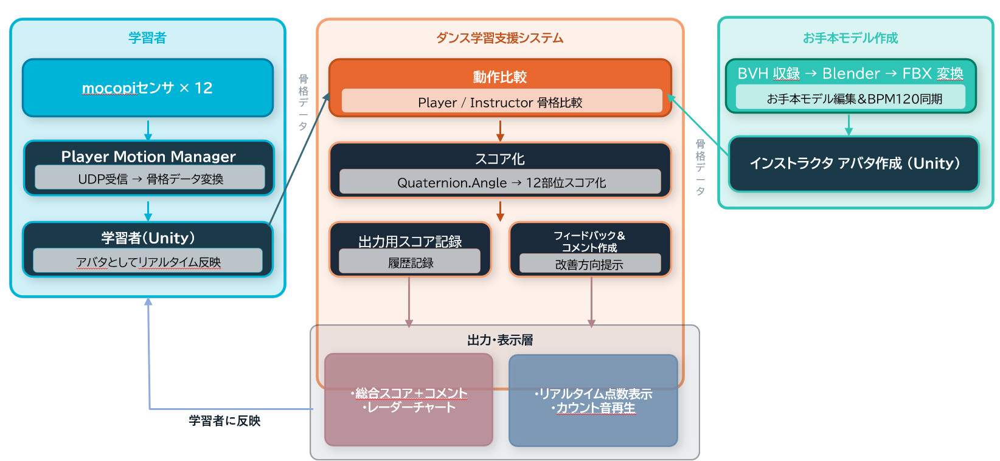
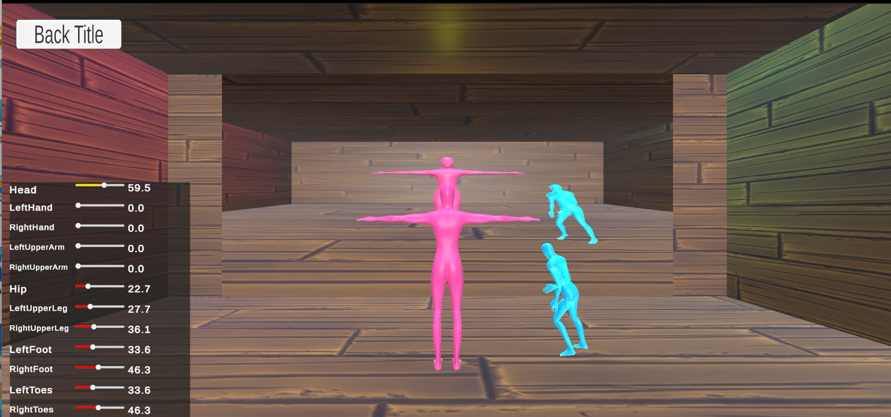
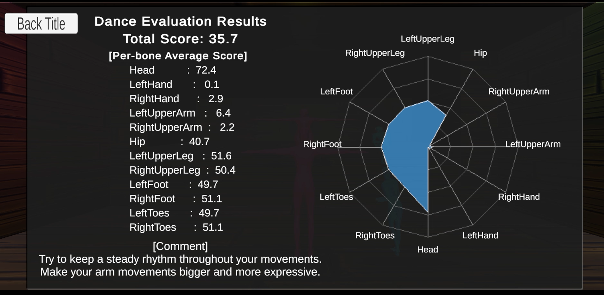

# フルボディトラッキングによるダンス学習支援システム(VR-Dance-Learning-System)
#　概要
本研究は、UnityとSony「mocopi」を用いて開発したダンス学習支援システムです。
学習者のダンス動作とインストラクターの動作をリアルタイムで比較し、動作の一致度を可視化することで、ストリートダンスの効率的な練習を支援することを目的としています。
本システムは学部時代の研究活動の一環として開発しました。

# 主な機能
- mocopiを持ちいたリアルタイム全身モーションキャプチャ
- インストラクターのダンスモーション再生
- 学習者アバタのリアルタイム再生
- 動作一致度を点数化する
- ダンス学習終了後のフィードバックコメント表示

# システム構成
システムは以下の要素で構成されています。

1. mocopiセンサ装着後、mocopiPCアプリケーションに接続する。
2. モーションデータをUnityへ送信
3. アバタのアニメーションを参考に同時にダンスをする
4. 動作比較および一致度の算出
5. フィードバック

# 使用技術
- Unity(C#)
- Sony mocopi SDK
- UDP通信
- FBXアニメーション

# 担当内容
本研究では、以下の開発を担当しました。
- システム設計および実装
- 動作一致度算出アルゴリズム開発
- ユーザーインターフェース実装
- 実験設計および評価

# イメージ画面
## 実演画面

## 結果画面

## YouTubeデモ動画
[ダンス学習支援システム](https://youtu.be/4xgdGRJMGDA)

# 研究目的
本研究の目的は、低コストかつ安全性の高いダンス教育支援システムを実現するために、モーションキャプチャ技術と VR 技術を組み合わせ、学習者が指導者の動きを模倣しながら効率的にダンスを習得できる学習支援システムを開発する。
従来の対面指導では、時間・場所、指導者の確保といった制約があります。本システムでは、それらの制約を軽減しながら、学習者が自主的かつ効果的に練習できる環境の実現を目指しています。

# 今後の展望
- モーションキャプチャ精度の向上
- 一致度評価手法の高度化
- AIを活用した個別フィードバック機能の実装
- 対応ダンスジャンルの拡張

# リポジトリ構成
本リポジトリには、システムの主要機能に関するスクリプトを掲載しています。

## 動作一致度の算出
学習者と模範動作の骨格情報を比較し、リアルタイムでの動作一致度を算出します。部位ごとの評価および総合評価を行い、学習状況を定量的に把握できるようにしています。
- RealTimeScoreManager.cs
- ScoreRecorder.cs

## モーションデータの処理やアバタ制御
mocopiから取得したモーションデータをUnity上で処理し、アバタ動作へ反映します。ダンス学習に必要な骨格情報の取得や管理を行っています。また、模範動作を行うInstructorアバタと、学習者の動作を反映するPlayerアバタを制御します。両者の動作を同一空間上で表示することで、動きの比較を容易にしています。
- DanceSessionController.cs
  
## フィードバック生成
算出した評価結果を基に、部位別スコアやレーダーチャートを表示します。学習者が改善点を直感的に理解できるフィードバック機能を実装しています。
- RadarChartRenderer.cs
- BoneScoreUI.cs
  
## カウント機能
ダンス開始前にカウントダウンを表示し、学習者が適切なタイミングで動作を開始できるよう支援します。模範動作と学習者の計測開始タイミングを統一し、評価精度の向上にも寄与しています。
- CountdownController.cs
- BeatManager.cs

