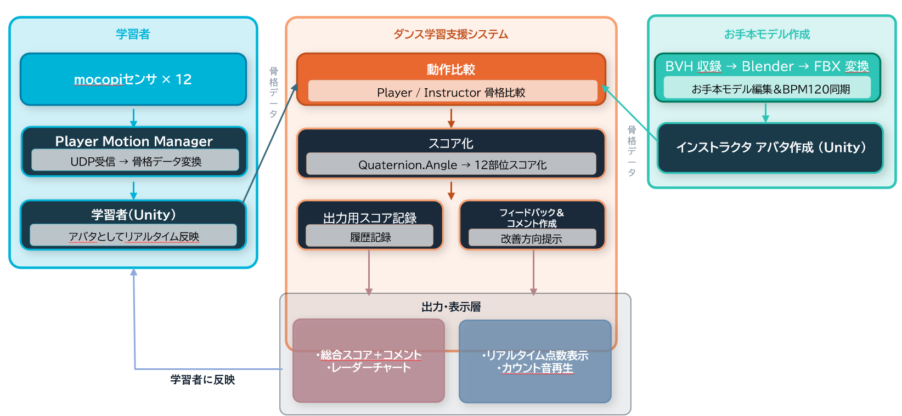
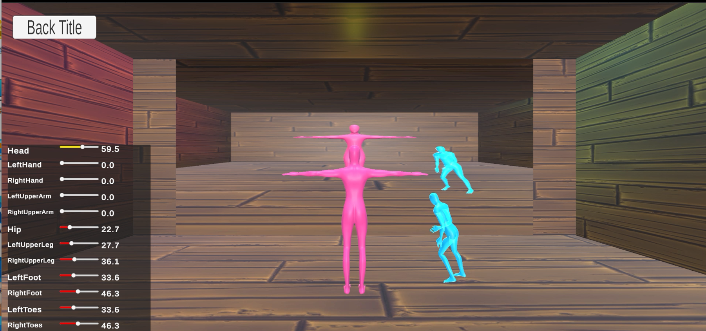
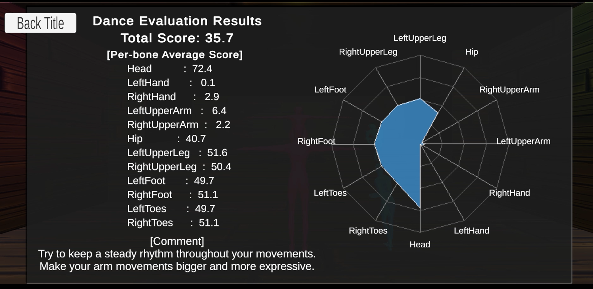

# フルボディトラッキングによるダンス学習支援システム

UnityとSony「mocopi」を用いて開発した、ダンス初心者向けの学習支援システムです。

学習者と模範動作をリアルタイムで比較し、身体部位ごとの動作一致度を可視化することで、自分の動きを客観的に確認しながら練習できる環境の実現を目指しました。

本システムは、学部時代の卒業研究として設計・開発・評価を行いました。

## 💡 開発背景

私は大学からダンスを始め、自主練習では動画を見ながら振付を覚えることが多くありました。

しかし、動画を見て動きを真似するだけでは、「自分のどの部分が模範動作と違うのか」「どの程度できているのか」を自分だけで判断することが難しいという課題を感じました。

そこで、モーションキャプチャを用いて学習者の身体動作を取得し、模範動作との違いをリアルタイムで可視化することで、一人でも自分の動きを客観的に確認しながら練習できるシステムを開発しました。

## 🎯 目指した体験

単にダンスの動きを計測するのではなく、

- 自分の動きをその場で確認できる
- どの身体部位を改善すればよいか分かる
- 練習後に自分の動きを振り返ることができる

という、初心者が一人でも改善点を見つけながら練習できる体験を目指しました。

## ✨ 主な機能

- mocopiを用いたリアルタイム全身モーションキャプチャ
- 模範となるダンスモーションの再生
- 学習者の動きを反映したアバタのリアルタイム表示
- 学習者と模範動作のリアルタイム比較
- 身体部位ごとの動作一致度の算出
- レーダーチャートによる評価結果の可視化
- ダンス学習終了後のフィードバック表示
- 計測タイミングを合わせるためのカウントダウン

## ⚙️ システムの流れ

1. 学習者がmocopiセンサを装着し、mocopiアプリケーションと接続
2. 取得したモーションデータをUnityへ送信
3. Unity上のPlayerアバタへ学習者の動きを反映
4. Instructorアバタで模範ダンスモーションを再生
5. 学習者と模範動作の骨格情報をリアルタイムで比較
6. 身体部位ごとの動作一致度を算出
7. 評価結果を可視化し、練習後のフィードバックとして提示

### システム構成

## 🛠 使用技術

- Unity / C#
- Sony mocopi
- UDP通信
- FBXアニメーション

## 👩‍💻 担当範囲

卒業研究として、システムの設計から実装、評価まで一貫して担当しました。

- システム全体の設計・実装
- mocopiを用いたモーションデータ取得
- アバタ制御
- 動作一致度算出アルゴリズムの設計・実装
- ユーザーインターフェースの設計・実装
- フィードバック機能の実装
- 実験設計
- ユーザー評価・結果分析

## 🧠 設計・実装で工夫したこと

### 身体部位ごとに動作を評価

単一の総合点だけでは「どこを直せばよいのか」が分かりにくいと考え、身体部位ごとに模範動作との差を算出する方式にしました。

各部位の姿勢差を評価し、それぞれの結果をスコアとして提示することで、学習者が改善すべき部分を確認できるようにしています。

### リアルタイムでフィードバック

練習終了後だけでなく、動いている最中にも自分の状態を確認できるようリアルタイム評価を採用しました。

学習者の動きと模範動作を同一空間上のアバタとして表示し、動作中にも違いを確認できるようにしています。

### レーダーチャートによる可視化

数値だけでは身体全体の傾向を把握しにくいため、部位別の評価結果をレーダーチャートとして表示しました。

どの部位の評価が高く、どの部位に改善の余地があるのかを視覚的に確認できるようにしています。

### 計測開始タイミングの統一

ダンスでは、学習者と模範動作の開始タイミングがずれると正しく比較できません。

そこで、ダンス開始前にカウントダウンを表示し、模範動作の再生と学習者の計測開始タイミングを合わせる仕組みを実装しました。

## 📊 評価

開発したシステムを実際に使用してもらい、ユーザビリティやダンス練習支援としての有効性について評価実験を行いました。

15名を対象に評価を実施し、システムの使用感やフィードバックの分かりやすさなどを確認しました。

※評価方法・結果については、公開可能な範囲で今後追記予定です。

## 🎥 デモ

### 実演画面

### 結果画面

### YouTubeデモ動画

[ダンス学習支援システム デモ動画](https://youtu.be/4xgdGRJMGDA)

## 📁 主なスクリプト

本リポジトリでは、システムの主要機能に関するスクリプトを公開しています。

### 動作一致度の算出

学習者と模範動作の骨格情報を比較し、リアルタイムで動作一致度を算出します。

- `RealTimeScoreManager.cs`
- `ScoreRecorder.cs`

### モーションデータ処理・アバタ制御

mocopiから取得したモーションデータをUnity上で処理し、Playerアバタへ反映します。また、模範動作を行うInstructorアバタと学習者のPlayerアバタを制御します。

- `DanceSessionController.cs`

### フィードバック表示

算出した評価結果を基に、身体部位ごとのスコアやレーダーチャートを表示します。

- `RadarChartRenderer.cs`
- `BoneScoreUI.cs`

### カウント・タイミング制御

ダンス開始前のカウントダウンや、模範動作と計測の開始タイミングを制御します。

- `CountdownController.cs`
- `BeatManager.cs`

## 🔭 今後の改善

評価実験や開発を通して、以下の改善が必要だと考えています。

- モーションキャプチャデータのノイズへの対応
- 身体差を考慮した比較方法の改善
- 動作一致度評価手法の高度化
- フィードバック内容の改善
- ユーザーが継続して練習したくなるフィードバック方法の検討
- 対応するダンスジャンル・動作の拡張

## 🌱 この開発を通して学んだこと

開発当初は、モーションキャプチャやリアルタイムでの身体動作比較に関する知識が十分にある状態ではありませんでした。

「ダンス初心者が自分の動きを客観的に確認できる体験を作りたい」という目的から、必要な技術を調査し、mocopiからのデータ取得、Unity上でのアバタ制御、模範動作との比較、評価結果の可視化まで段階的に実装しました。

この経験から、特定の技術を使うことを目的とするのではなく、実現したい体験から必要な技術を考え、学びながら形にしていくことの重要性を学びました。
